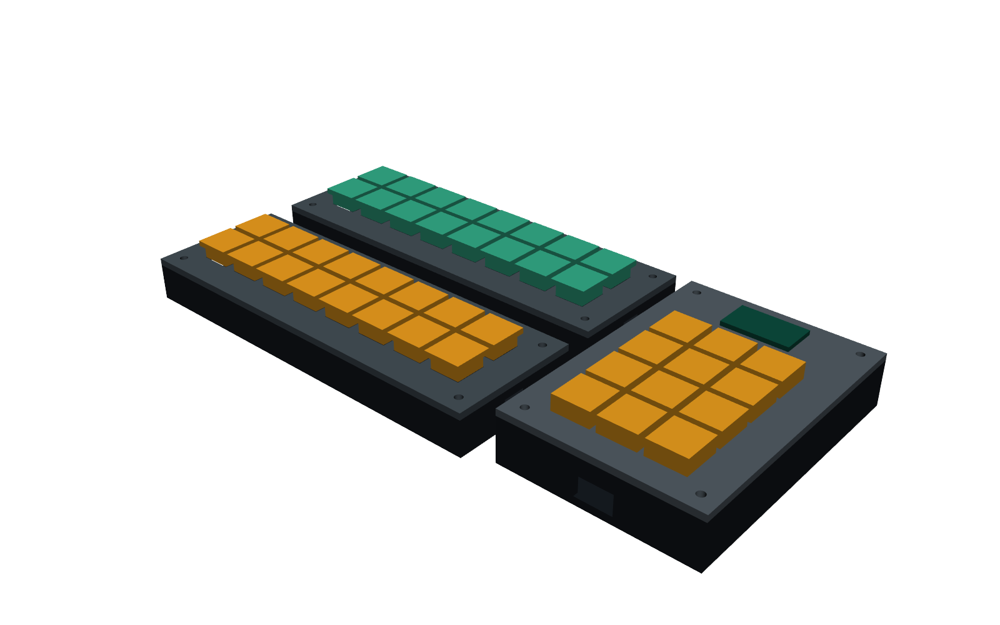
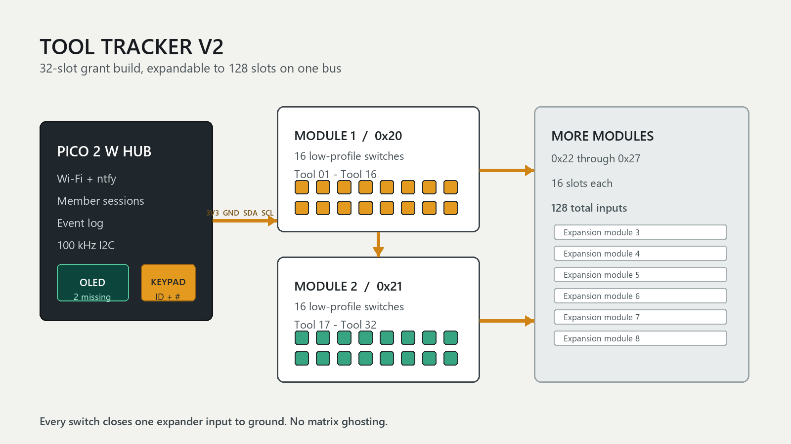
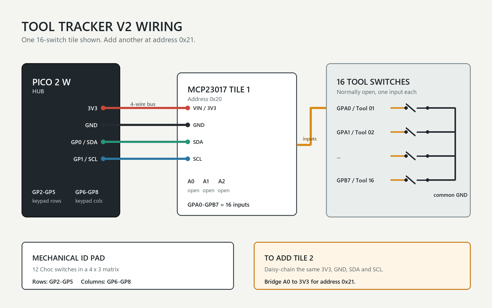

# Tool Tracker V2

Tool Tracker V2 is a modular tray that knows which tools are in their spots.
Each tool rests on a low-profile mechanical switch. When a tool is lifted or
put back, a Raspberry Pi Pico 2 W records the change and can send an ntfy
alert.

The first build has 32 tool spots, a 12-key member ID pad, and a small screen.
The tray is split into 16-switch modules, so another module can be plugged
into the same four-wire bus.

## Why I am making it

Shared toolboxes are easy to check at the start of a meeting and hard to check
at the end. A paper checklist only works when everyone remembers to use it.
This tray updates itself whenever a tool moves.

The number pad adds basic accountability without making every tool carry a
tag. A member enters an ID, takes a tool, and the event is attached to that
session.

## Current status

The original three-switch test worked on real hardware. V2 is designed and
the firmware has passed a computer smoke test, but the 32-slot version has not
been printed or wired yet. That is what this funding would pay for.

## How it works

- The Pico 2 W is the hub.
- Each MCP23017 board reads 16 switches.
- Every expansion board has its own I2C address.
- Two boards give the first prototype 32 tool spots.
- Eight boards can share one bus, for 128 spots.
- A TCA9548A bus multiplexer could add more branches later.
- The mechanical keypad starts a member session and the OLED shows the status.

The switches are wired directly to expander inputs with pull-ups. There is no
keyboard matrix on the tool tray, so pressing several tool switches at once
does not cause ghost keys.

## Files

- `cad/` has the CadQuery source and printable STEP/STL exports.
- `firmware/` has the MicroPython code.
- `electronics/` has the wiring and address plan.
- `BOM.csv` has the parts and estimated cost.
- `FUNDING_PITCH.md` has the short submission text.
- `JOURNAL.md` records the design work.

## Build plan

1. Print one hub case and two 16-switch tray modules.
2. Mount the Choc switches in the tray plates.
3. Wire each bank of 16 switches to one MCP23017 breakout.
4. Set the two expansion addresses to `0x20` and `0x21`.
5. Connect both boards and the OLED to the Pico I2C bus.
6. Wire the 12-key pad as a 4-row by 3-column matrix on GP2 through GP8.
7. Upload the files in `firmware/`.
8. Test every slot 100 times before putting the tray in a toolbox.

The tray plates are included in Choc and MX versions. The first prototype uses
Kailh Choc V1 switches because they are thin and inexpensive.

The example settings keep ntfy off, so the switch tray can be tested without
Wi-Fi first. Add private Wi-Fi and topic values only in `settings.py`.

## Prototype limits

- The first version uses I2C and is meant for one drawer or short cabinet bus.
- The total bus cable should stay under about one metre and run at 100 kHz.
- This is an inventory aid, not a lock or theft-prevention device.
- The member ID is identification, not secure authentication.
- Tool names and private Wi-Fi/ntfy settings stay in a local `settings.py`.

## Commands

- `/status` sends the missing-tool list and active member.
- `/pause 30m` pauses normal alerts for 30 minutes.
- `/pause 2h` pauses them for two hours.
- `/resume` starts alerts again.

## Sources

- [MCP23017 data sheet](https://ww1.microchip.com/downloads/aemDocuments/documents/APID/ProductDocuments/DataSheets/MCP23017-Data-Sheet-DS20001952.pdf)
- [Raspberry Pi Pico 2 W data sheet](https://datasheets.raspberrypi.com/picow/pico-2-w-datasheet.pdf)
- [Stardance hardware submission guide](https://stardance.hackclub.com/resources/shipping-hardware)

## License

MIT
